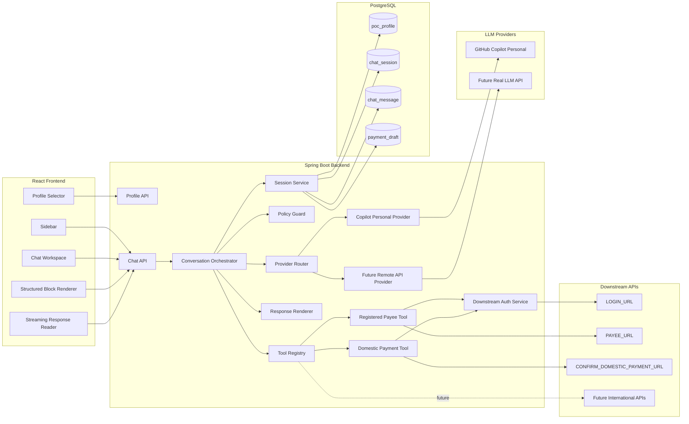
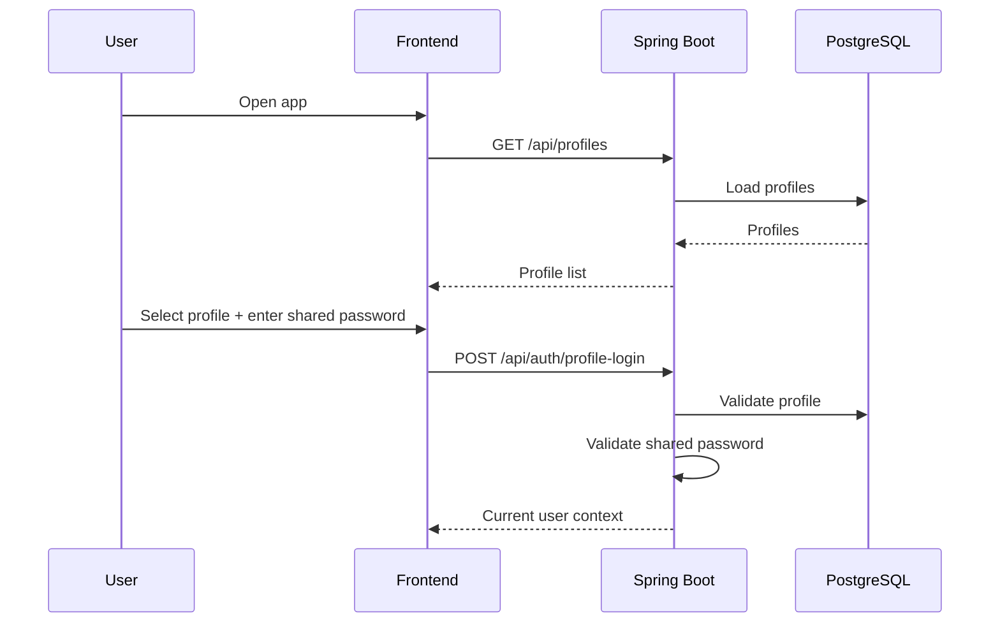
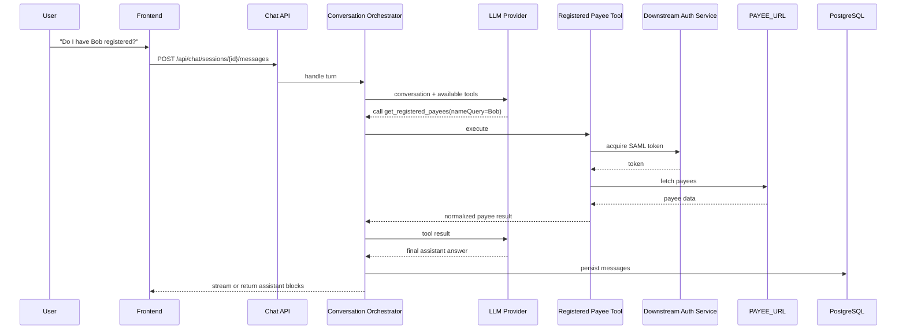
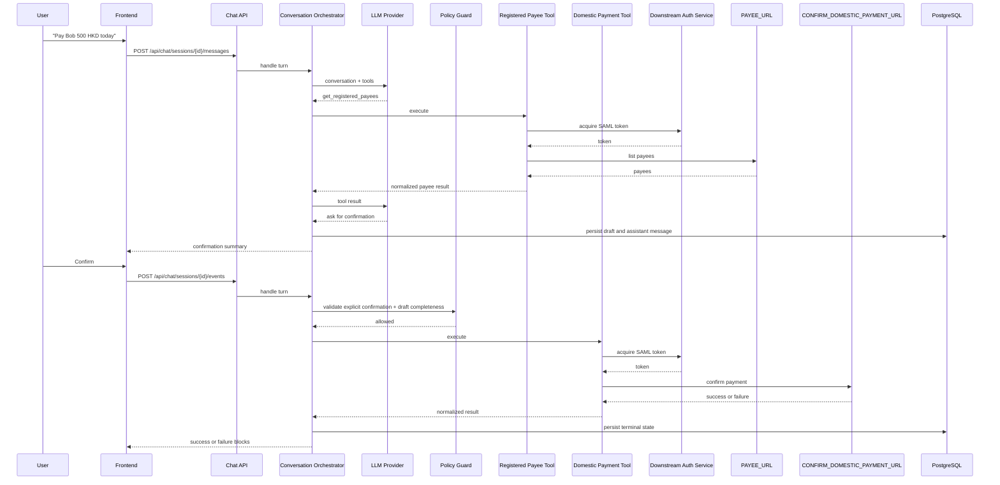

# chat2pay - System Design

## 1. Purpose

This document defines the updated POC design for **chat2pay**.

The goal of this revision is to absorb the useful behavior proven by
[`99-ref.md`](99-ref.md):

- the backend can talk to a personal-subscription GitHub Copilot path
- the assistant can distinguish payee lookup from payment execution
- the backend can execute downstream tools and continue the conversation
- the frontend remains a chat UI instead of a transfer wizard

The implementation stack stays the same:

- frontend: React + TypeScript
- backend: Spring Boot
- database: PostgreSQL

The frontend never talks to an LLM directly and never calls downstream payment
APIs directly.

## 2. Scope

### 2.1 Version 1

Version 1 must reproduce the useful capability already demonstrated by
`99-ref.md`, but in the Java backend:

- support personal-subscription GitHub Copilot access from the backend
- support registered payee lookup
- support domestic payment to a registered payee
- support multi-turn clarification with the user
- support exactly two business downstream APIs:
  - `PAYEE_URL`
  - `CONFIRM_DOMESTIC_PAYMENT_URL`
- obtain downstream SAML token before each downstream business call
- persist sessions, messages, and active draft in PostgreSQL
- no Redis

### 2.2 Version 2

Version 2 extends the same architecture:

- add international payment
- add more downstream tools and APIs
- use a real LLM API as the primary provider
- keep GitHub Copilot personal-subscription access as a fallback option

## 3. Explicit Non-Goals for V1

- no frontend-to-LLM connection
- no frontend-to-downstream API connection
- no Redis
- no WebSocket requirement
- no code generation from the API contract
- no duplicate contract copy under a separate `api-contract/` directory
- no complex frontend transfer wizard or "Transfer Flow" modal
- no international payment execution in V1
- no new payee creation in V1

## 4. Design Principles

1. **Backend owns orchestration.**
   The Java backend decides which LLM provider to use, which tools are exposed,
   when a tool may run, and how downstream responses become frontend blocks.

2. **Frontend stays thin.**
   The current frontend shell is kept, but it only renders sessions, messages,
   and backend-provided structured blocks.

3. **Provider access must be pluggable.**
   V1 uses GitHub Copilot personal-subscription access. V2 can switch the
   primary provider to a real API without changing frontend contracts.

4. **Tool execution must be extensible.**
   V1 only needs two downstream business tools, but the backend should be built
   as a tool registry so V2 can add international payment and more checks
   without rewriting the chat controller.

5. **Critical side effects stay guarded.**
   The LLM may infer intent and request tool calls, but the backend must enforce
   confirmation and payload validation before payment execution.

6. **PostgreSQL is the only shared state store in V1.**
   Session state, message history, and active payment draft live in PostgreSQL.
   Any in-memory cache is optional, local, and non-authoritative.

7. **The UI should feel conversational, not workflow-heavy.**
   The user interacts through chat messages, payee choices, and confirmation
   cards. We do not build a separate transfer wizard.

## 5. High-Level Architecture



## 6. Capability Model

### 6.1 V1 Capabilities

V1 exposes only two payment-related business capabilities:

| Capability | User-facing purpose | Downstream tool |
|---|---|---|
| `REGISTERED_PAYEE_LOOKUP` | Find one or more registered payees | `get_registered_payees` |
| `DOMESTIC_PAYMENT` | Pay a registered domestic payee | `confirm_domestic_payment` |

`REGISTERED_PAYEE_LOOKUP` may be used on its own, or as part of the domestic
payment journey.

### 6.2 V2 Extension Direction

V2 adds capabilities without changing the outer chat contract:

- `INTERNATIONAL_PAYMENT`
- extra downstream checks
- more tool definitions
- real API LLM provider as primary

## 7. Conversation and Tool Orchestration

The backend should use a **tool-based orchestration loop**, not a frontend
wizard and not a large monolithic service.

### 7.1 Turn Lifecycle

For each user message or UI event:

1. load session history and the active draft from PostgreSQL
2. choose the current LLM provider through the provider router
3. send conversation context plus the allowed tool definitions
4. if the LLM asks for a tool call, validate it in the backend
5. execute the tool through the tool registry
6. append tool results back into the loop if another LLM step is needed
7. persist the resulting assistant message and updated draft
8. stream or return structured blocks to the frontend

### 7.2 Backend Guardrails

The backend, not the model, enforces these rules:

- `confirm_domestic_payment` is unavailable until required fields are complete
- explicit user confirmation is required before payment execution
- opaque fields such as `payeeIdIndex` are never shown to the user
- downstream response errors are normalized before returning to the frontend
- the loop has a hard iteration limit

### 7.3 Recommended Interfaces

```java
public interface LlmProvider {
    ProviderTurnResult runTurn(LlmTurnRequest request);
    ProviderStreamResult streamTurn(LlmTurnRequest request);
}

public interface ConversationTool {
    String name();
    ToolExecutionResult execute(ToolExecutionContext context);
}
```

This keeps the controller stable while V2 adds more providers and tools.

## 8. LLM Provider Strategy

### 8.1 V1 Primary Provider

V1 uses a backend adapter around personal-subscription GitHub Copilot access.

Responsibilities:

- use configured personal credentials or session token
- refresh or reacquire short-lived Copilot session tokens inside the backend
- hide provider-specific request details from the rest of the application
- support normal response mode and streaming mode

Suggested implementation name:

- `CopilotPersonalLlmProvider`

### 8.2 V2 Primary Provider

V2 adds:

- `RemoteApiLlmProvider`

That provider becomes the primary path for production-like usage, while
`CopilotPersonalLlmProvider` remains available as a fallback.

### 8.3 Provider Routing

The provider router should support:

- configured primary provider
- configured fallback provider
- explicit session-level provider logging for troubleshooting

Example:

- V1: `COPILOT_PERSONAL`
- V2: `REMOTE_API`, fallback `COPILOT_PERSONAL`

## 9. Downstream Integration Strategy

### 9.1 Shared Authentication Pattern

Every downstream business call uses the same sequence:

1. read the current profile `username`
2. treat it as downstream identity input
3. call `LOGIN_URL`
4. get the SAML token
5. call the target business API with the required header

This auth sequence belongs in a shared backend service, not inside each tool.

### 9.2 V1 Tool Set

V1 tools:

| Tool | Purpose | Downstream dependency |
|---|---|---|
| `get_registered_payees` | Retrieve and optionally filter registered payees | `PAYEE_URL` |
| `confirm_domestic_payment` | Execute confirmed domestic payment | `CONFIRM_DOMESTIC_PAYMENT_URL` |

Recommended internal split:

- `RegisteredPayeeTool`
- `DomesticPaymentTool`
- `DownstreamAuthService`

### 9.3 Future Tool Growth

When V2 adds international payment, new downstream APIs should arrive as new
tool classes, not as conditionals inside `DomesticPaymentTool`.

## 10. FE/BE Streaming Choice

### 10.1 Decision

Use **SSE-style event streaming over HTTP** between frontend and backend.

Do **not** use WebSocket in V1.

### 10.2 Why SSE Instead of WebSocket

- the traffic is request-driven and mostly server-to-client during a turn
- we need progressive assistant text, not a long-lived bidirectional channel
- HTTP infrastructure, auth, logging, and failure handling stay simpler
- Spring Boot and browser `fetch` both handle streaming well enough for this
  use case
- the frontend still sends user input through normal HTTP requests

### 10.3 Usage Pattern

- profile, auth, session list, and history APIs stay normal JSON REST endpoints
- message submission and structured UI events support:
  - normal JSON response
  - streamed `text/event-stream` response

Expected stream events:

- `user-message`
- `assistant-message-start`
- `assistant-message-delta`
- `assistant-message-complete`
- `turn-error`

The frontend reads the response stream from the Java backend. It never connects
to the LLM directly.

## 11. Session and Draft State

### 11.1 Session State

Persisted session state should stay simple:

| State | Meaning |
|---|---|
| `IDLE` | No active payment draft |
| `COLLECTING_DETAILS` | Need payee, amount, or payment date |
| `AWAITING_PAYEE_SELECTION` | Multiple payees matched |
| `AWAITING_CONFIRMATION` | Draft is ready and waiting for explicit confirmation |
| `EXECUTING` | Backend is calling payment confirmation |
| `COMPLETED` | Payment succeeded |
| `FAILED` | Payment failed |
| `CANCELLED` | User cancelled the active draft |

Payee lookup without a transfer can leave the session in `IDLE`.

### 11.2 Draft State

Persist a payment draft only when a payment is being prepared.

Minimum V1 draft fields:

- payee input text
- selected payee id
- selected payee name
- selected payee type
- selected bank details
- amount
- currency
- payment date
- confirmation status
- downstream result summary

## 12. Core Sequences

### 12.1 Profile Login



### 12.2 Registered Payee Lookup



### 12.3 Domestic Payment



## 13. Frontend Implications

The frontend keeps the current shell, but should simplify behavior:

- keep profile selector, sidebar, and chat workspace
- remove the heavy "Transfer Flow" treatment
- render only backend-provided blocks and status
- prefer conversational text plus light cards and lists
- avoid frontend-owned branching logic

## 14. V2 Compatibility Notes

This design intentionally leaves room for V2:

- more tools can be added without changing the controller contract
- the provider router can switch from Copilot to a real API
- international payment can be added as new tools plus new draft fields
- PostgreSQL remains sufficient for the current scale; Redis is not required
  for V1

## 15. Design Summary

The updated design is:

- backend-orchestrated
- tool-based
- PostgreSQL-backed
- SSE-streamed
- GitHub Copilot personal-subscription compatible in V1
- ready to grow into real API LLM + international payment in V2
