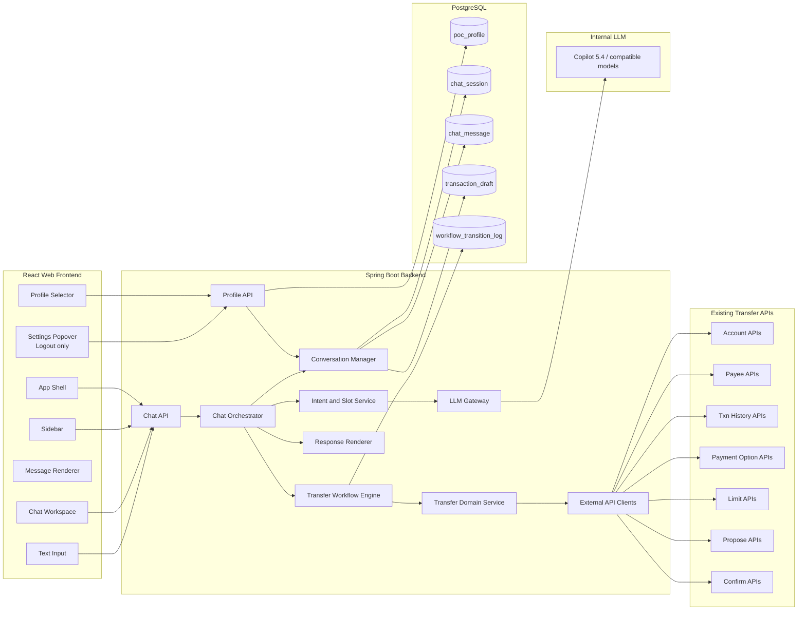
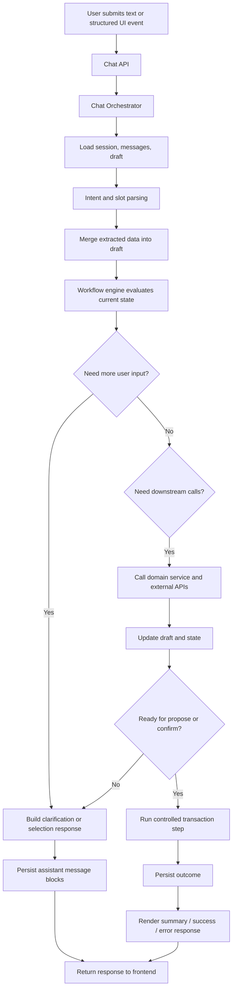
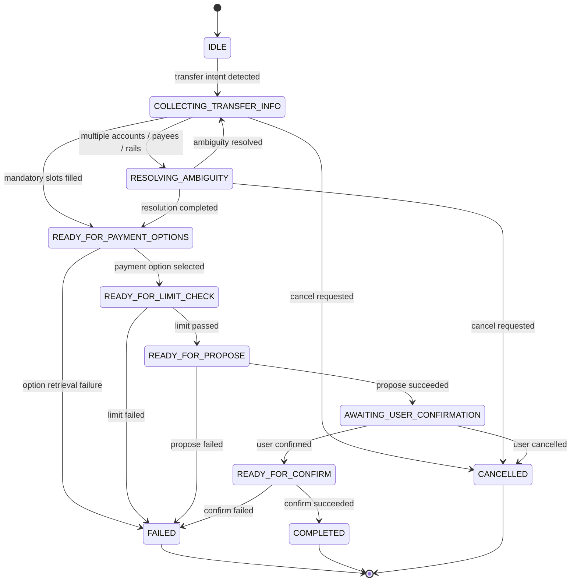
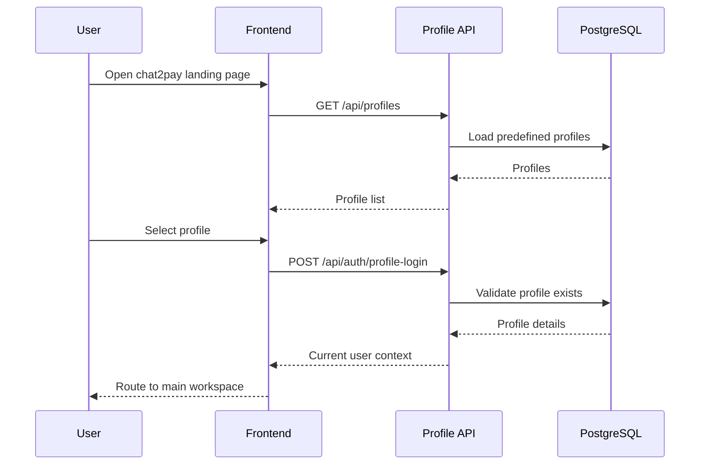
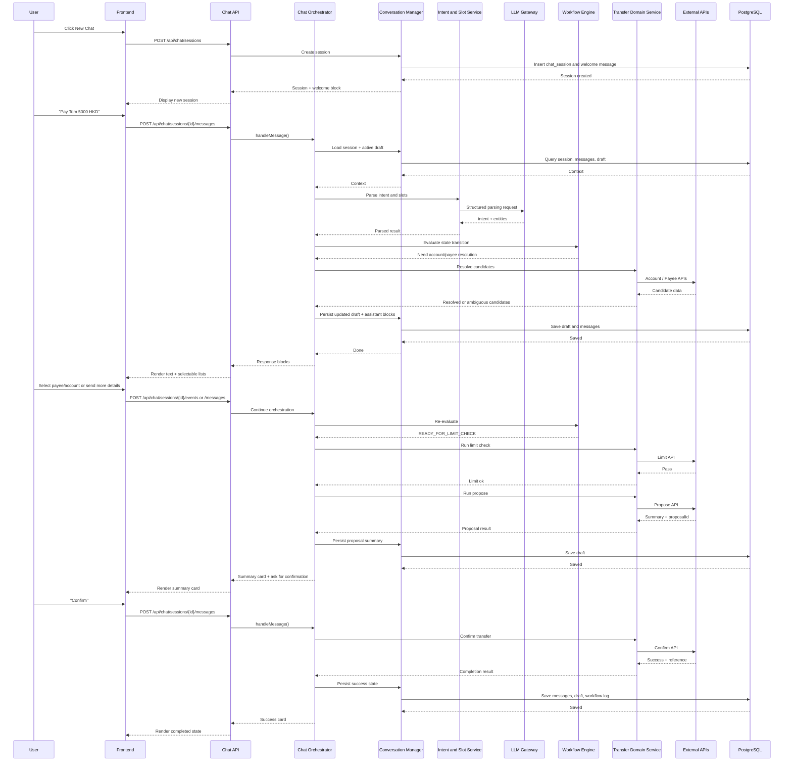
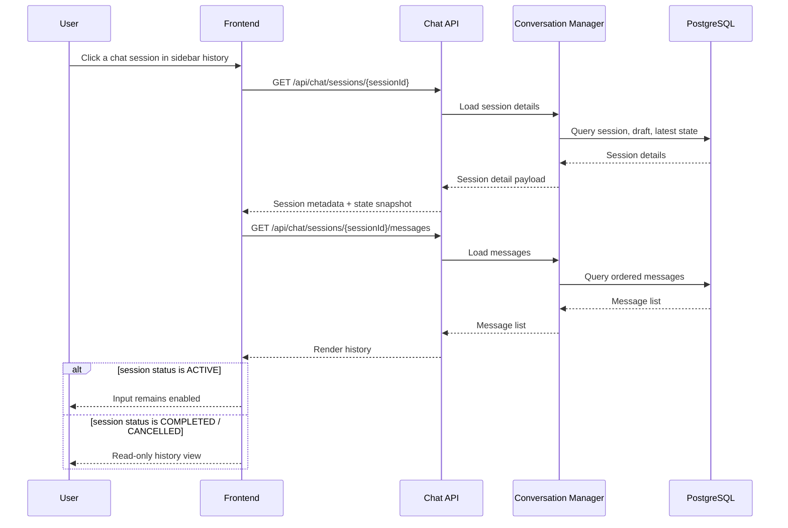
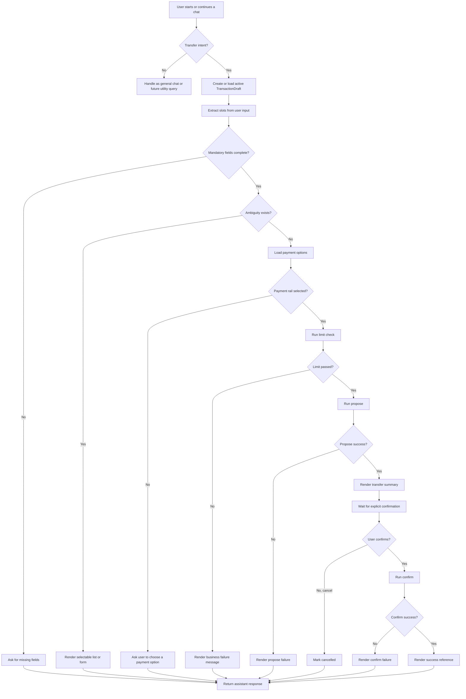

# chat2pay - System Design

## 1. Overview

**chat2pay** is an internal web-based POC that allows a user to complete a money transfer through a conversational interface.  
The user first selects a predefined **profile** on the landing page. For the POC, profile selection acts as a lightweight login.  
After login, the user enters a ChatGPT-style workspace with:

- a collapsible left sidebar
- a right-side chat workspace
- chat history
- a fixed profile section at the bottom of the expanded sidebar
- assistant responses rendered as text, structured cards, selectable lists, and simple forms

The system is intentionally designed as a **deterministic transfer orchestration backend with LLM assistance**, not as a fully autonomous agent.

## 2. Goals

### In Scope

- Web-based internal POC
- Profile-based pseudo-login
- Conversational transfer journey
- Chat history persistence in PostgreSQL
- Structured assistant responses:
  - text
  - summary cards
  - selectable lists
  - simple forms
- Integration with existing downstream APIs over HTTP + JSON:
  - account list / details
  - payee list / details
  - transaction history
  - payment options
  - limit check / update
  - propose transaction
  - confirm transaction
- Lightweight workflow state machine
- Internal LLM integration (for example Copilot 5.4-compatible internal model endpoints)

### Out of Scope

- Real authentication / authorization
- MFA / step-up verification
- Production-grade fraud controls
- Voice input
- File upload
- Full admin console
- Full implementation of left-menu utility features such as **My Account**, **My Payee**, and **Transaction History**

## 3. Design Principles

1. **LLM assists; backend controls.**  
   The LLM is used for intent parsing, entity extraction, clarification phrasing, and response generation.  
   The backend remains responsible for workflow progression and all downstream transaction actions.

2. **One session, one active transfer draft at a time.**  
   Each chat session can carry one active `TransactionDraft` that is gradually enriched through the conversation.

3. **Deterministic transfer execution.**  
   Downstream APIs such as propose / confirm are never called directly by the model.

4. **UI is conversational but structured.**  
   Free-text remains the primary input, but the assistant can return structured UI blocks to reduce ambiguity and speed up completion.

5. **Persistence focuses on user value and recoverability.**  
   Chat history, workflow state, and transfer draft must survive page refresh and history reopening.

## 4. High-Level Architecture

## 5. Frontend Architecture

### 5.1 Pages and Major Areas

#### A. Profile Selection Page
- Landing page for the POC
- Shows 4–5 mock profiles
- Selecting a profile acts as login
- On success, routes to the main chat page

#### B. Main Workspace
Layout:
- **Left sidebar**
  - New Chat
  - Placeholder utility items:
    - My Account
    - My Payee
    - Transaction History
  - Chat History list
  - Fixed bottom user identity area with avatar + username
- **Right workspace**
  - chat title / session header
  - assistant and user messages
  - structured cards / lists / forms
  - primary text input box

#### C. User Settings Popover
- Triggered from the bottom-left avatar/username section
- POC options:
  - Logout

### 5.2 Frontend Modules

| Module | Responsibility |
|---|---|
| `ProfileSelectorPage` | Fetch profiles, display cards, perform pseudo-login |
| `AppLayout` | Overall layout shell and routing |
| `Sidebar` | New chat, placeholders, chat history list |
| `UserMenu` | Bottom fixed avatar + username + logout popover |
| `ChatPage` | Main conversation workspace |
| `MessageList` | Render ordered message stream |
| `MessageRenderer` | Render text, cards, lists, forms, error blocks |
| `ChatInputBar` | Free-text input, send action, busy state |
| `StructuredActionPanel` | Handle selectable list and form events |
| `HistoryLoader` | Load and display an existing session |
| `ProfileStore` | Keep selected profile in client state |
| `ChatStore` | Current session, message stream, pagination, draft snapshot |

## 6. Backend Architecture

### 6.1 Core Modules

| Module | Responsibility |
|---|---|
| `ProfileApiController` | Public endpoints for profile list, profile login, logout, current user context |
| `ChatApiController` | Session and message endpoints consumed by the frontend |
| `ChatOrchestrator` | Central application coordinator for every user turn |
| `ConversationManager` | Load / save session, messages, active draft, workflow snapshots |
| `IntentAndSlotService` | Convert user input into structured intent + entities |
| `LlmGateway` | Prompt management, model calls, schema-constrained parsing |
| `TransferWorkflowEngine` | Lightweight state machine for transfer progression |
| `TransferDomainService` | Business-oriented orchestration and downstream decisioning |
| `ResponseRenderer` | Convert domain outcomes into frontend-ready content blocks |
| `ExternalApiClients` | Typed HTTP clients for account, payee, payment, limit, propose, confirm, history APIs |
| `WorkflowTransitionLogger` | Persist state transitions and action results for diagnostics |

### 6.2 Why the Orchestrator-Centric Design

The backend is deliberately centered around a **Chat Orchestrator** because the conversation may require:

- loading prior state
- extracting new slots from the latest user message
- resolving ambiguity
- calling downstream APIs
- deciding whether to ask for more input or proceed
- rendering a structured response

This reduces controller complexity and prevents workflow logic from leaking into transport or client code.

## 7. Message Handling Flow

## 8. Transfer Workflow

### 8.1 Workflow State Machine

### 8.2 Workflow State Enumeration

| State | Meaning |
|---|---|
| `IDLE` | Session created, no active transfer flow yet |
| `COLLECTING_TRANSFER_INFO` | User is providing source account, payee, amount, currency, or note |
| `RESOLVING_AMBIGUITY` | Backend needs the user to resolve multiple candidates |
| `READY_FOR_PAYMENT_OPTIONS` | Basic draft is complete; payment method options must be loaded or selected |
| `READY_FOR_LIMIT_CHECK` | Draft is sufficient for a limit check |
| `READY_FOR_PROPOSE` | Draft is sufficient for propose |
| `AWAITING_USER_CONFIRMATION` | Propose completed; assistant is waiting for explicit user confirmation |
| `READY_FOR_CONFIRM` | User confirmed and backend may call confirm |
| `COMPLETED` | Transfer successfully completed |
| `FAILED` | Flow failed due to business or technical error |
| `CANCELLED` | User explicitly cancelled the in-progress transfer |

### 8.3 Workflow Event Enumeration

| Event | Meaning |
|---|---|
| `SESSION_CREATED` | New chat session created |
| `USER_TEXT_RECEIVED` | User submitted free-text input |
| `USER_UI_EVENT_RECEIVED` | User interacted with a list or form |
| `TRANSFER_INTENT_DETECTED` | Intent parser recognized transfer initiation |
| `SLOTS_UPDATED` | One or more draft fields were merged |
| `AMBIGUITY_DETECTED` | Multiple candidate accounts / payees / rails found |
| `AMBIGUITY_RESOLVED` | User selected a concrete candidate |
| `PAYMENT_OPTIONS_LOADED` | Payment options returned successfully |
| `PAYMENT_OPTION_SELECTED` | User or system selected the final transfer rail |
| `LIMIT_CHECK_PASSED` | Limit API returned success |
| `LIMIT_CHECK_FAILED` | Limit API returned failure |
| `PROPOSE_SUCCEEDED` | Propose API succeeded |
| `PROPOSE_FAILED` | Propose API failed |
| `USER_CONFIRMED` | User explicitly confirmed the transfer |
| `USER_CANCELLED` | User explicitly cancelled the transfer |
| `CONFIRM_SUCCEEDED` | Confirm API succeeded |
| `CONFIRM_FAILED` | Confirm API failed |
| `SYSTEM_ERROR` | Unexpected internal error |

## 9. Core End-to-End Sequences

### 9.1 Profile Login and Workspace Entry

### 9.2 New Chat and Transfer Journey

### 9.3 Open Existing Chat History

## 10. Transfer Flowchart

## 11. Key DTOs

### 11.1 Current User and Profile

#### `ProfileSummary`
- `id`
- `code`
- `displayName`
- `avatarUrl`
- `mockCustomerId`
- `locale`
- `status`

#### `CurrentUserContext`
- `profileId`
- `username`
- `displayName`
- `avatarUrl`
- `locale`
- `loginMode` = `PROFILE_SELECTION`

### 11.2 Chat Session

#### `ChatSessionSummary`
- `sessionId`
- `title`
- `status`
- `createdAt`
- `updatedAt`
- `lastAssistantText`
- `workflowState`

#### `ChatSessionDetail`
- `sessionId`
- `title`
- `status`
- `createdAt`
- `updatedAt`
- `activeDraft`
- `workflowSnapshot`

### 11.3 Messages

#### `ChatMessage`
- `messageId`
- `sessionId`
- `role` (`USER`, `ASSISTANT`, `SYSTEM`)
- `messageType` (`TEXT`, `CARD`, `LIST`, `FORM`, `UI_EVENT`)
- `text`
- `contentBlocks`
- `createdAt`

#### `ContentBlock`
Shared fields:
- `blockId`
- `type`
- `title`
- `metadata`

Block variants:
- `TextBlock`
- `SummaryCardBlock`
- `SelectableListBlock`
- `SimpleFormBlock`
- `ErrorCardBlock`
- `InfoCardBlock`

### 11.4 Requests

#### `CreateChatSessionRequest`
- `title` (optional)

#### `SendMessageRequest`
- `messageText`
- `clientMessageId` (optional)

#### `UiEventRequest`
- `eventType`
- `sourceMessageId`
- `sourceBlockId`
- `selectedItemIds`
- `formValues`
- `clientEventId` (optional)

### 11.5 Chat Turn Response

#### `ChatTurnResponse`
- `session`
- `userEchoMessage` (optional)
- `assistantMessages`
- `draftSummary`
- `workflowState`
- `suggestedActions`
- `serverTimestamp`

### 11.6 Transaction Draft

#### `TransactionDraft`
- `draftId`
- `sessionId`
- `status`
- `workflowState`
- `sourceAccountId`
- `sourceAccountDisplay`
- `payeeId`
- `payeeDisplay`
- `amount`
- `currency`
- `paymentRail`
- `note`
- `limitCheckStatus`
- `proposalId`
- `proposalSummary`
- `transferReference`
- `lastUpdatedAt`

## 12. Technology Choices

### Backend
- **Java 21**
- **Spring Boot 3**
- Spring Web
- Spring Validation
- Spring Data JPA
- PostgreSQL
- OpenAPI-generated DTOs / interfaces
- Feign or Spring HTTP Interface / RestClient for downstream API integration
- Jackson for JSON and JSONB payload mapping

### Frontend
- **React**
- **Ant Design 6**
- **Tailwind CSS**
- React Router
- TanStack Query or equivalent for API fetching/caching
- Zustand / Redux Toolkit / Context for local session state

### Database
- **PostgreSQL**
- JSONB for structured message blocks and proposal summaries
- Application-generated ULIDs for ordered identifiers

## 13. Suggested Non-Functional Rules for the POC

- One active draft per session
- Explicit confirmation required before confirm API call
- Every state transition logged
- Every assistant structured block persisted
- Recoverable page refresh:
  - current session reloads from backend
  - history view can reconstruct the full conversation
- Protected APIs trust the selected profile in POC mode

## 14. Future Evolution

The current design leaves room for:

- real authentication
- MFA / transaction signing
- richer profile settings
- reusable utility flows for **My Account**, **My Payee**, and **Transaction History**
- recommendation cards
- multi-step draft editing
- observability dashboards
- policy-based transfer validation
- model routing across multiple internal LLMs
