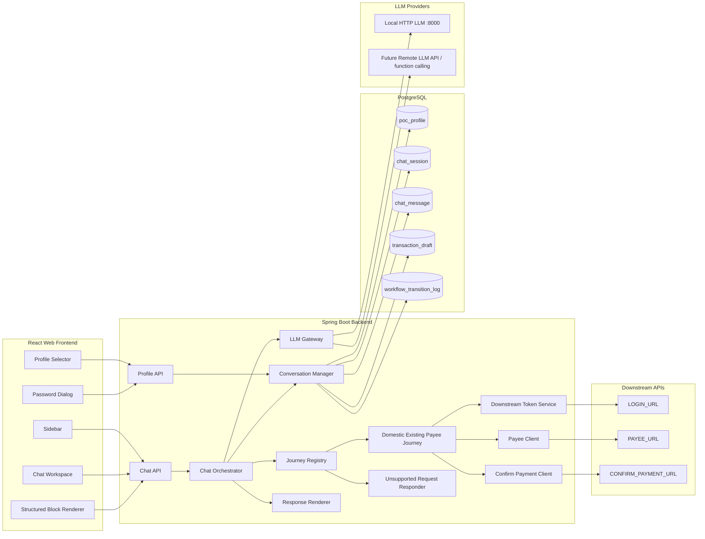
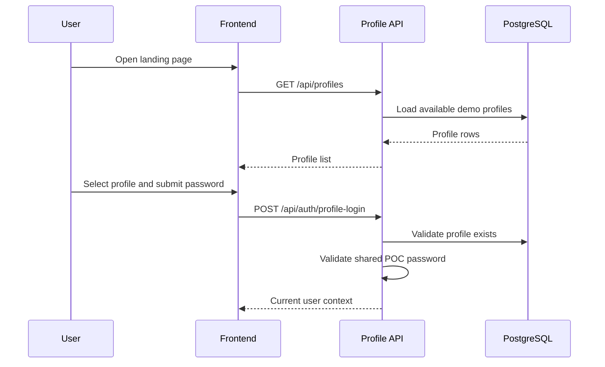
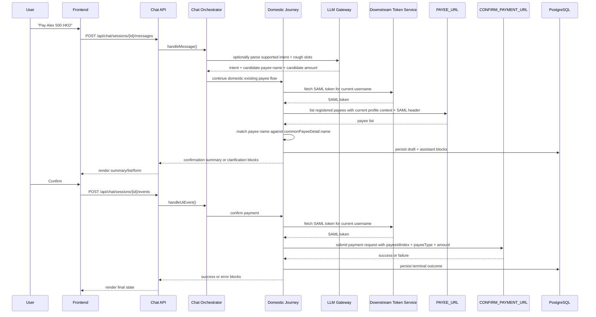
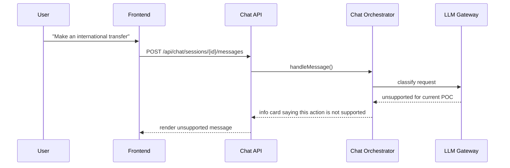

# chat2pay - System Design

## 1. Overview

**chat2pay** is an internal web-based POC that lets a user complete a payment
journey through a conversational interface.

The frontend keeps the current high-fidelity layout and styling:

- profile selection page
- shared password dialog
- sidebar + chat workspace
- structured assistant blocks inside the conversation

The backend is the control plane. The frontend never calls an LLM directly and
never calls downstream payment APIs directly.

## 2. Current POC Scope

### In Scope

- profile list returned by backend API
- shared password gate retained in the frontend flow
- one backend-owned conversational payment journey
- current supported journey:
  - `DOMESTIC_EXISTING_PAYEE`
- local LLM integration through the backend calling the local HTTP + JSON
  service documented in `docs/10-local_LLM.md`
- downstream API integration through Spring Boot
- existing payee lookup through `PAYEE_URL`
- final payment submission through `CONFIRM_PAYMENT_URL`
- downstream SAML acquisition through `LOGIN_URL` before every downstream call
- chat history and workflow persistence in PostgreSQL
- unsupported user requests answered with a clear "not supported in this POC"
  response

### Out of Scope for This POC

- direct frontend-to-LLM calls
- direct frontend-to-downstream API calls
- new payee creation
- international payment execution
- limit check, bank check, FX rate, or proposal flows in the first POC slice
- MFA, fraud controls, production authn/authz

## 3. Design Principles

1. **Frontend is presentation only.**
   The current UI stays largely as-is, but the business flow must move into the
   Spring Boot backend.

2. **LLM assists; backend decides.**
   LLM output may help with intent detection, slot extraction, and response
   phrasing. Workflow transitions and downstream side effects remain deterministic
   backend decisions.

3. **Current domestic payment matching is deterministic.**
   For the first POC slice, payee resolution should mirror
   `docs/11-backend-skill.md`: fetch registered payees, then match the
   user-provided payee name against `commonPayeeDetail.name` inside the backend.

4. **All downstream calls share one auth pattern.**
   Every call to a downstream business API must first obtain a SAML token from
   `LOGIN_URL`, then place that token in the downstream request header.

5. **`username` is the downstream identity key.**
   The profile field named `username` is the `payment10` value used in
   downstream URLs and auth context.

6. **Payment journeys must be pluggable.**
   The first implementation only supports domestic transfer to an existing payee,
   but the backend must be structured so future journeys can add extra checks and
   steps without rewriting the chat controller or frontend.

7. **Conversation stays stable; orchestration evolves behind it.**
   The frontend continues to render text, summary cards, selectable lists, and
   simple forms. New journey complexity should appear as backend-generated blocks,
   not as frontend-specific orchestration logic.

## 4. High-Level Architecture



## 5. Frontend Architecture

The frontend layout and visual language are already close to target and should
not be materially redesigned.

### 5.1 Kept UX Structure

- landing page with selectable profiles
- shared password dialog
- left sidebar with chat history and current user identity
- right chat workspace with message stream and structured cards

### 5.2 Frontend Responsibilities

| Area | Responsibility |
|---|---|
| Profile selector | Fetch profiles from backend and collect the shared password |
| Session shell | Create sessions, switch history, render current workflow summary |
| Message renderer | Render backend-provided text, cards, lists, and forms |
| Chat input | Collect free text only |
| Structured UI events | Send list and button interactions back to backend |

### 5.3 Explicit Non-Responsibilities

- no frontend LLM client
- no frontend payee lookup client
- no frontend payment confirm client
- no frontend SAML token handling
- no frontend branching logic for domestic vs international flows

## 6. Backend Architecture

### 6.1 Core Modules

| Module | Responsibility |
|---|---|
| `ProfileApiController` | List POC profiles, validate shared password, return current user context |
| `ChatApiController` | Create sessions, accept free-text messages, accept structured UI events |
| `ChatOrchestrator` | Central application coordinator for every turn |
| `JourneyRegistry` | Select the correct payment journey handler for the current intent |
| `DomesticExistingPayeeJourney` | Current POC flow implementation |
| `UnsupportedRequestResponder` | Return stable unsupported-operation responses |
| `ConversationManager` | Load and persist session, messages, draft, and workflow logs |
| `LlmGateway` | Provider-neutral LLM adapter |
| `PayeeMatcher` | Deterministically match free-text payee names against payee list data |
| `DownstreamTokenService` | Obtain SAML token from `LOGIN_URL` for every downstream call |
| `PayeeClient` | Call `PAYEE_URL` using the current profile context after SAML acquisition |
| `ConfirmPaymentClient` | Call `CONFIRM_PAYMENT_URL` using the current draft and downstream auth context |
| `ResponseRenderer` | Convert domain outcomes into frontend-ready content blocks |

### 6.2 Recommended Package Direction

```text
chat2pay-app/
└── src/main/java/.../chat2pay/
    ├── api/
    ├── application/
    │   ├── chat/
    │   ├── profile/
    │   └── journey/
    ├── domain/
    │   ├── conversation/
    │   └── payment/
    ├── integration/
    │   ├── llm/
    │   └── downstream/
    ├── persistence/
    ├── config/
    └── common/
```

## 7. LLM Strategy

### 7.1 Current Provider

The first implementation should use a backend-only local provider that talks to
the local service described in `docs/10-local_LLM.md`, typically through
`POST /api/chat` on `http://localhost:8000`.

Typical uses:

- detect whether the user is asking for a supported payment journey
- extract payee and amount candidates from free text
- produce short clarification phrasing when deterministic templates are not
  enough

Important limitation for the first journey:

- do not use the LLM to decide the final payee match
- use backend deterministic matching against `commonPayeeDetail.name`
- do not require function calling for the first POC slice

### 7.2 Future Provider Compatibility

The backend must not expose provider-specific behavior to the frontend.
Introduce a provider-neutral interface such as:

```java
public interface LlmProvider {
    ParsedIntent parseIntent(ChatTurnContext context);
    AssistantCopy generateAssistantCopy(AssistantCopyRequest request);
}
```

The first implementation can be `LocalHttpLlmProvider`.
A future implementation can be `RemoteApiLlmProvider` that uses real remote API
calls and function calling, while preserving the same backend-facing contract.

## 8. Downstream Auth and Client Strategy

Every downstream business call follows the same sequence:

1. read the current profile `username`
2. treat that value as downstream `payment10`
3. build the configured `LOGIN_URL` with that `payment10`
4. obtain a SAML token
5. call the business API with the SAML token in the required header

For the first POC slice, assume this happens on every downstream call. Do not
design around frontend token reuse.

This applies to `PAYEE_URL`, `CONFIRM_PAYMENT_URL`, and future downstream APIs.

Recommended backend abstraction:

```java
public interface DownstreamAuthenticatedCaller {
    <T> T execute(ProfileContext profile, DownstreamRequest<T> request);
}
```

That abstraction lets later integrations add more clients without duplicating
the login-before-call pattern.

## 9. Payment Journey Model

### 9.1 Generic Journey Contract

The orchestration layer should route each turn to a journey handler instead of
embedding all payment logic in one service.

Suggested shape:

```java
public interface PaymentJourneyHandler {
    boolean supports(JourneyType journeyType);
    JourneyTurnResult handleText(TurnContext context);
    JourneyTurnResult handleUiEvent(TurnContext context);
}
```

### 9.2 Current Journey: `DOMESTIC_EXISTING_PAYEE`

The current POC supports only this journey.

Happy path:

1. user expresses intent to pay a registered domestic payee
2. backend extracts or asks for payee and amount
3. backend calls `PAYEE_URL`
4. backend matches the user-provided name against `commonPayeeDetail.name`
5. backend stops if there is no unique match
6. backend renders a confirmation summary
7. user confirms
8. backend calls `CONFIRM_PAYMENT_URL` using `payeeIdIndex`, `payeeType`,
   amount, and configured payload defaults
9. backend returns success or failure

### 9.3 Unsupported Requests

If the user asks for anything outside this journey, the assistant should return
an explicit unsupported response, for example:

- international transfer
- new payee setup
- balance inquiry
- transaction history actions

The session stays usable; the user can still start a supported domestic transfer.

### 9.4 Future Journeys

Future journey handlers can add extra steps such as:

- limit check
- bank check
- FX quote retrieval
- compliance screening
- new payee verification

Those steps should live inside journey-specific handlers, not inside the chat
controller or frontend.

## 10. Workflow States

The current backend contract should use a smaller state set that matches the
first POC slice.

| State | Meaning |
|---|---|
| `IDLE` | Session created, no active payment yet |
| `COLLECTING_PAYMENT_DETAILS` | Backend is collecting payee and amount |
| `RESOLVING_PAYEE` | Backend is resolving an existing payee candidate |
| `AWAITING_USER_CONFIRMATION` | Summary is ready and user confirmation is required |
| `CONFIRMING_PAYMENT` | Backend is calling downstream confirm APIs |
| `COMPLETED` | Payment succeeded |
| `FAILED` | Payment failed due to business or technical error |
| `CANCELLED` | User cancelled the active journey |

## 11. Core Sequences

### 11.1 Profile Login



### 11.2 Domestic Existing Payee Payment



### 11.3 Unsupported Operation


